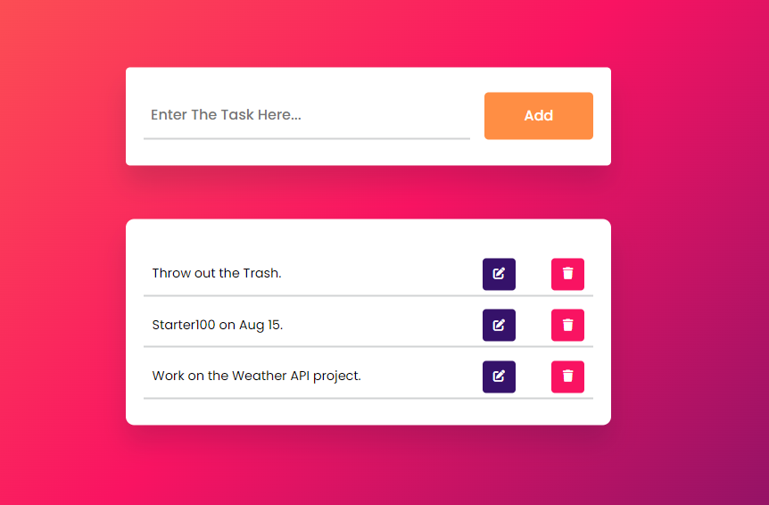

# To Do List
## A simple To Do List web-app, that lets you save your tasks locally.
<br>



<br>
This a simple web project, a Task Recorder of sorts. <br>

### It lets you:
- add new tasks to the list.
- remove tasks from the list.
- mark tasks as done by clicking each task.

Each task is saved using 'localStorage' API, so it won't get removed if the site is refreshed or closed.
You can only remove tasks by deleting them. It allows you to store key-value pairs persistently in the user's browser.

# HTML:
- The HTML structure defines the layout of the web page.

- The <head> section contains metadata and resources required for the page. It includes:
  - meta name="viewport" content="width=device-width, initial-scale=1.0"
  - title of the web page
  - web page icon
  - links to the stylesheet and external fonts

- It includes a container for the to-do list, a section for adding new tasks, and a section to display existing tasks.
  - container: This div serves as a container for the entire content of the page.
  - new-task: This div contains the input field and button for adding new tasks.
  - input: An input field where users can type new tasks.
  - button: A button that users can click to add new tasks.
  - tasks: This div is intended to display the list of existing tasks.
- Social icons (Instagram, GitHub, LinkedIn) are included as well, linking to my/your respective profiles.

- script src: This includes the JavaScript file (script.js) that adds dynamic functionality to the web page.

>> Overall, this HTML code sets up the basic structure of a to-do list web page. The container div holds the "new_task" input area and the area for displaying tasks. The social-icons div holds links to social media profiles. The JavaScript file (script.js) adds interactivity to the page, allowing users to manage tasks dynamically.

# CSS:
- The CSS styles define the appearance of the elements on the web page.
- The container class centers the content on the page.
- Styling for the input field, buttons, and task items is provided.
- Completed tasks have a strikethrough effect applied.
- Social icons have a hover effect for visual feedback.

# JavaScript:
- The JavaScript code provides the dynamic functionality for the to-do list.
- We have these 8 simple functions:
  - Create Initial References
  - Implement Function On Window Load
  - Function To Display Tasks
  - Set Function To Disable Edit Tasks
  - Function To Remove Tasks From Local Storage
  - A Function To Add Tasks To Local Storage
  - Function To Add A New Task
  - Add Functionality To Edit & Delete Buttons
 
- Window Load Function:
  - The code inside the window.onload function is executed when the web page finishes loading.
  - It initializes variables, counts the number of tasks, and calls the displayTasks function to show tasks stored in local storage.

- Display Tasks Function:
  - The displayTasks function populates the list of tasks on the page based on data in local storage.
  - It clears the tasksDiv (the container for tasks) and then loops through each task in local storage.
  - For each task, it creates a task element with buttons for editing and deleting.
  - It handles click events for task completion and editing.

- Edit Tasks:
  - When the "Edit" button is clicked, it captures the task for editing by storing its content and removes it from the display.
  - This allows the user to edit the task using the input field.

- Delete Tasks:
  - When the "Delete" button is clicked, it removes the task from both the display and local storage.

- Update Storage Function:
  - The updateStorage function adds or updates tasks in local storage based on completion status.
  - It uses a combination of the task's index and name to store task data.

- Add New Task Function:
  - The "Add" button click event triggers the addition of a new task to both the display and local storage.
  - It manages editing of existing tasks by removing and re-adding them with updated content.

- Disable Buttons Function:
  - The disableButtons function disables or enables all "Edit" buttons based on a boolean value.
  - This function is used to control the state of edit buttons when a task is being edited.

>> JavaScript code provides the interactivity for your to-do list application. It handles adding, editing, completing, and deleting tasks while maintaining the task data in local storage. The code keeps the display and local storage synchronized so that tasks remain persistent across page reloads.

# How the Tasks are stored?

1. **Storing Tasks Locally:**
   When a new task is added or an existing task is updated, the `updateStorage` function is called to store the task data in local storage. The `updateStorage` function takes three arguments:
   - `index`: An identifier for the task, often representing its position in the list.
   - `taskValue`: The content of the task.
   - `completed`: A boolean value indicating whether the task is completed.

   Here's the relevant part of the code that stores tasks in local storage:

   ```javascript
   const updateStorage = (index, taskValue, completed) => {
     localStorage.setItem(`${index}_${taskValue}`, completed);
     displayTasks(); // Updates the display after updating local storage
   };
   ```

   Each task is stored in local storage using a unique key that combines the `index` and `taskValue`. The value associated with this key is the `completed` status of the task.

2. **Removing Tasks Locally:**
   When a task is deleted, the `removeTask` function is called to remove the task's data from local storage. The `removeTask` function takes a single argument, which is the key representing the task's data in local storage. Here's the relevant part of the code that removes tasks from local storage:

   ```javascript
   const removeTask = (taskValue) => {
     localStorage.removeItem(taskValue);
     displayTasks(); // Updates the display after removing from local storage
   };
   ```

   The `localStorage.removeItem(taskValue)` line removes the task's data associated with the provided key from local storage. After removing the task from local storage, the `displayTasks` function is called to update the display to reflect the updated task list.

By using `localStorage`, tasks are stored in the user's browser and persist even after the page is closed or refreshed. The code ensures that the local storage and the displayed task list remain synchronized, so changes made to one are reflected in the other.


[TO DO LIST](https://arindal1.github.io/To-Do-List-WebApp/)
